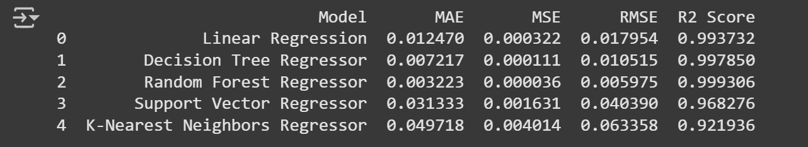

# Laporan Proyek Machine Learning - Aksamala Citrayuh Anasita
**Supplement Sales Data**

## Domain Proyek
Dalam industri penjualan produk kesehatan dan suplemen, pemahaman yang mendalam terhadap faktor-faktor yang memengaruhi pendapatan dan performa produk sangat krusial untuk mendukung pengambilan keputusan bisnis yang strategis. Data penjualan yang dikumpulkan secara mingguan dari berbagai produk, kategori, lokasi, dan platform menawarkan peluang besar untuk mengeksplorasi pola perilaku konsumen, tren penjualan musiman, hingga efektivitas strategi promosi.

Namun, tantangan utama yang dihadapi adalah besarnya volume data serta kompleksitas hubungan antar variabel, seperti harga, diskon, jumlah unit terjual, dan platform penjualan. Jika data ini tidak dianalisis secara sistematis, maka potensi informasi berharga yang terkandung di dalamnya dapat terabaikan, sehingga menghambat optimalisasi proses bisnis.

Proyek ini bertujuan untuk mengatasi tantangan tersebut dengan menerapkan pendekatan machine learning (ML) guna mengolah dan menganalisis data penjualan suplemen secara komprehensif. Fokus utama dari proyek ini adalah membangun model prediktif untuk memperkirakan revenue serta mengklasifikasikan platform penjualan berdasarkan atribut transaksi yang tersedia. Selain itu, dilakukan eksplorasi terhadap berbagai algoritma dan teknik seperti regresi, klasifikasi, dan neural network, yang dilengkapi dengan evaluasi performa dan penyetelan hyperparameter guna memperoleh hasil prediksi yang optimal.

Permasalahan dalam prediksi penjualan dan analisis performa produk menjadi sangat penting untuk diselesaikan karena secara langsung berdampak pada efisiensi operasional dan pencapaian target pendapatan perusahaan. Ketidakmampuan dalam memprediksi revenue dan tren penjualan secara akurat dapat menimbulkan berbagai risiko seperti kelebihan stok, kekurangan pasokan, serta kampanye promosi yang tidak tepat sasaran. Hal ini pada akhirnya dapat menyebabkan pemborosan anggaran, penurunan kepuasan pelanggan, serta hilangnya peluang penjualan yang berharga (Mulyana et al., 2024).

Sebagai solusi, dibutuhkan pendekatan yang lebih cerdas dan adaptif, yaitu dengan memanfaatkan teknologi machine learning. Teknologi ini memungkinkan perusahaan untuk:
* Mengolah data dalam skala besar secara efisien.
* Mengidentifikasi pola perilaku konsumen yang kompleks.
* Memodelkan prediksi penjualan berdasarkan variabel-variabel historis seperti kategori produk, harga, lokasi, platform distribusi, dan faktor musiman.

Berbeda dengan pendekatan manual atau konvensional yang cenderung subjektif dan berbasis intuisi, model ML dapat menghasilkan prediksi yang dinamis dan terus diperbarui sesuai dengan perubahan data. Dengan demikian, perusahaan mampu mengambil keputusan secara lebih cepat dan tepat berbasis data (data-driven decision making), mengoptimalkan pengelolaan stok dan sumber daya, serta merancang strategi pemasaran yang lebih efektif dan personal (Sunaryo et al., 2024).

**Referensi:**
- [APA] (Mulyana, A., Azwar, K., Yuniawati, R. I., Soegiarto, D., Afma, V. M., & Setiajatnika, E. (2024). Penganggaran Perusahaan. Tohar Media.)
- [APA] (Sunaryo, D., Hamdan, A. A., & Cecilia Winata, D. D. A. (2024). Prediksi tren risiko keuangan perusahaan berdasarkan model machine learning (ARIMA): Tinjauan literatur. Jurnal Akuntansi Manajemen, 3(2), 78-94.)

## Business Understanding
Dalam konteks bisnis suplemen kesehatan, perusahaan menghadapi tantangan untuk memahami pola pembelian pelanggan, performa produk, serta efektivitas strategi penjualan di berbagai platform dan lokasi. Dengan tersedianya data penjualan mingguan yang kaya, perusahaan ingin memanfaatkan machine learning untuk membuat keputusan berbasis data (data-driven decision making).

### Problem Statements
1. Penjualan suplemen yang tidak konsisten dapat menyebabkan kerugian bagi perusahaan. Tanpa pemahaman yang baik tentang faktor-faktor yang mempengaruhi penjualan, perusahaan mungkin tidak dapat mengoptimalkan strategi pemasaran dan distribusi mereka. Hal ini dapat mengakibatkan produk yang baik tidak terjual dengan baik, sementara produk yang kurang diminati tetap mendapatkan perhatian yang lebih.  
2.	Terdapat banyak kategori produk suplemen yang berbeda, dan tidak semua produk memiliki performa penjualan yang sama. Perusahaan perlu mengetahui produk mana yang paling menguntungkan dan mana yang kurang diminati oleh konsumen. Tanpa analisis yang tepat, perusahaan tidak dapat mengidentifikasi peluang untuk meningkatkan penjualan atau mengurangi kerugian dari produk yang tidak laku.    

### Goals
1. Membangun model prediksi yang dapat membantu perusahaan memahami faktor-faktor yang mempengaruhi penjualan suplemen, sehingga mereka dapat mengoptimalkan strategi pemasaran dan distribusi untuk meningkatkan penjualan. Dengan model ini, perusahaan diharapkan dapat meramalkan penjualan di masa depan dan mengambil langkah-langkah yang diperlukan untuk meningkatkan performa produk.    
2.	Mengidentifikasi produk suplemen yang memiliki performa penjualan terbaik dan terburuk, serta menganalisis karakteristik produk tersebut untuk memberikan wawasan yang dapat digunakan dalam pengembangan produk dan strategi pemasaran. Dengan informasi ini, perusahaan dapat fokus pada produk yang menguntungkan dan melakukan perbaikan pada produk yang kurang diminati.

    ### Solution statements
    Dalam menghadapi tantangan yang dihadapi oleh perusahaan suplemen kesehatan, solusi yang efektif diperlukan untuk meningkatkan pemahaman tentang pola pembelian pelanggan dan performa produk. Dengan memanfaatkan data penjualan mingguan yang kaya, perusahaan dapat menerapkan berbagai teknik machine learning untuk mengoptimalkan strategi pemasaran dan distribusi. Solusi yang diusulkan mencakup pengembangan model prediksi yang dapat memberikan wawasan mendalam tentang faktor-faktor yang mempengaruhi penjualan, serta analisis yang lebih mendetail terhadap produk-produk yang ada. Dengan pendekatan ini, perusahaan tidak hanya dapat meningkatkan penjualan, tetapi juga dapat mengidentifikasi peluang untuk pengembangan produk dan perbaikan strategi pemasaran yang lebih efektif.
    1. Mengembangkan model regresi menggunakan algoritma machine learning seperti Random Forest Regressor dan Gradient Boosting untuk memprediksi penjualan suplemen berdasarkan fitur-fitur seperti kategori produk, harga, diskon, lokasi, dan platform penjualan. Model ini akan memberikan wawasan tentang faktor-faktor yang paling berpengaruh terhadap penjualan, sehingga perusahaan dapat mengoptimalkan strategi pemasaran dan distribusi mereka. Dengan memanfaatkan model ini, perusahaan diharapkan dapat meramalkan penjualan di masa depan dan mengambil langkah-langkah proaktif untuk meningkatkan performa produk.  

    2. Melakukan analisis eksplorasi data (EDA) untuk mengidentifikasi produk suplemen dengan performa penjualan terbaik dan terburuk. Dengan menggunakan visualisasi dan analisis statistik, perusahaan dapat menganalisis karakteristik produk yang berkontribusi pada penjualan yang tinggi atau rendah. Selain itu, menerapkan model klasifikasi, seperti K-Nearest Neighbors (KNN) atau Neural Networks, untuk mengelompokkan produk berdasarkan performa penjualannya. Dengan informasi ini, perusahaan dapat fokus pada pengembangan produk yang menguntungkan dan melakukan perbaikan pada produk yang kurang diminati, serta menyesuaikan strategi pemasaran untuk meningkatkan penjualan.     

    3.  Melakukan hyperparameter tuning pada model regresi dan klasifikasi untuk menemukan kombinasi parameter yang optimal. Dengan menggunakan teknik seperti Grid Search dan Cross-Validation, perusahaan dapat meningkatkan akurasi model dan memastikan bahwa model yang digunakan untuk prediksi dan klasifikasi memberikan hasil yang lebih baik. Ini akan membantu perusahaan dalam membuat keputusan yang lebih tepat berdasarkan data yang dianalisis.    

## Data Understanding
Proyek ini menggunakan dataset yang berisi informasi penjualan suplemen kesehatan mingguan. Dataset ini mencakup berbagai fitur yang relevan untuk menganalisis performa penjualan dan pola pembelian pelanggan. Dataset dapat diunduh dari tautan berikut: 
[Supplement Sales Data](https://www.kaggle.com/datasets/zahidmughal2343/supplement-sales-data). 

Dataset ini terdiri dari 4,384 entri dan 10 kolom, yang mencakup informasi tentang produk, penjualan, dan faktor-faktor lain yang mempengaruhi performa penjualan.    

### Variabel-variabel pada Restaurant UCI dataset adalah sebagai berikut:
- **Date**: Tanggal penjualan suplemen, yang menunjukkan waktu transaksi dilakukan.
- **Product Name**: Nama produk suplemen yang dijual, memberikan identifikasi spesifik untuk setiap item.
- **Category**: Kategori produk, yang mengelompokkan suplemen berdasarkan jenisnya, seperti protein, vitamin, omega, dan lainnya.
- **Units Sold**: Jumlah unit produk yang terjual dalam periode waktu tertentu, memberikan gambaran tentang volume penjualan.
-  **Price**: Harga per unit produk, yang menunjukkan nilai jual dari setiap suplemen.
- **Revenue**: Total pendapatan yang dihasilkan dari penjualan produk, dihitung sebagai hasil kali antara jumlah unit terjual dan harga.
- **Discount**: Persentase diskon yang diterapkan pada produk, yang dapat mempengaruhi keputusan pembelian pelanggan.
- **Units Returned**: Jumlah unit yang dikembalikan oleh pelanggan, memberikan informasi tentang kepuasan pelanggan dan kualitas produk.
- **Location**: Lokasi geografis tempat penjualan dilakukan, yang dapat mempengaruhi preferensi dan pola pembelian pelanggan.
- **Platform**: Platform penjualan, seperti Amazon, Walmart, atau iHerb, yang menunjukkan saluran distribusi produk.

**Exploratory Data Analysis (EDA)**
Untuk memahami data lebih dalam, saya melakukan beberapa tahapan analisis eksplorasi data (EDA). Proyek ini memvisualisasikan distribusi fitur numerik menggunakan histogram dan kernel density estimation (KDE) untuk mengidentifikasi pola dan outlier. Selain itu, proyek ini juga menganalisis distribusi fitur kategorikal dengan menggunakan countplot untuk melihat frekuensi setiap kategori. Korelasi antar fitur numerik dianalisis menggunakan heatmap, yang membantu dalam memahami hubungan antara variabel. Dengan langkah-langkah ini, saya dapat memperoleh wawasan yang lebih baik tentang data dan mempersiapkan model machine learning yang lebih efektif.

## Data Preparation
Dalam proyek ini dilakukan beberapa langkah persiapan data untuk memastikan bahwa dataset siap digunakan dalam model machine learning. Proses data preparation ini meliputi beberapa teknik yang dilakukan secara berurutan sebagai berikut:    
1.	**Mengubah Format Tanggal**: Kami mengubah kolom Date dari format string menjadi format datetime menggunakan pd.to_datetime(). Ini penting untuk memungkinkan analisis berbasis waktu, seperti tren penjualan dari waktu ke waktu.    
2.	**Menghapus Kolom yang Tidak Diperlukan**: Kami menghapus kolom Date dari dataset sebelum melakukan pemisahan fitur dan target, karena kolom ini tidak diperlukan dalam model prediksi. Kolom ini hanya digunakan untuk analisis temporal.    
3.	**Encoding Variabel Kategorikal**: Kami menggunakan LabelEncoder untuk mengubah variabel kategorikal, seperti Product Name, Category, Location, dan Platform, menjadi format numerik. Proses ini diperlukan karena algoritma machine learning umumnya tidak dapat memproses data dalam format string. Dengan mengubahnya menjadi angka, model dapat lebih mudah memahami dan memanfaatkan informasi tersebut.    
4.	**Normalisasi Fitur Numerik**: Kami menerapkan MinMaxScaler untuk menormalkan semua kolom numerik, termasuk Units Sold, Price, Revenue, Discount, dan Units Returned. Normalisasi ini penting untuk memastikan bahwa semua fitur berada dalam skala yang sama, sehingga tidak ada fitur yang mendominasi proses pelatihan model. Hal ini juga membantu dalam mempercepat konvergensi algoritma optimasi yang digunakan dalam pelatihan model.    
5.	**Pemisahan Data**: Kami membagi dataset menjadi set pelatihan dan set uji dengan proporsi 80% untuk pelatihan dan 20% untuk pengujian menggunakan train_test_split(). Pemisahan ini diperlukan untuk mengevaluasi kinerja model secara objektif dan memastikan bahwa model tidak overfitting pada data pelatihan.    
6.	**Menyiapkan Target Variabel**: Kami menentukan variabel target yang ingin diprediksi, yaitu Revenue. Dengan memisahkan fitur dan target, kami dapat fokus pada pelatihan model untuk memprediksi nilai yang diinginkan.  

Proses data preparation ini sangat penting untuk memastikan bahwa data yang digunakan dalam model machine learning bersih, terstruktur, dan siap untuk analisis. Hal itu dapat meningkatkan akurasi model dan mendapatkan hasil yang lebih baik dalam prediksi penjualan suplemen.

## Modeling
Dalam proyek ini terdapat beberapa algoritma machine learning yang digunakan untuk memprediksi penjualan suplemen kesehatan. Algoritma yang digunakan adalah Linear Regression, Decision Tree Regressor, Random Forest Regressor, Support Vector Regressor, dan K-Nearest Neighbors Regressor.    
1. **Linear Regression**
Linear Regression adalah algoritma yang paling sederhana dan paling umum digunakan dalam regresi. Algoritma ini memodelkan hubungan antara variabel independen dan dependen dengan menggunakan garis lurus. Parameter yang digunakan dalam Linear Regression adalah:    
- `fit_intercept`: True, yang berarti bahwa model akan mempertimbangkan konstanta dalam persamaan regresi.
- `normalize`: False, yang berarti bahwa data tidak akan dinormalisasi sebelum digunakan dalam model.  

2. **Decision Tree Regressor**
Decision Tree Regressor adalah algoritma yang menggunakan struktur pohon keputusan untuk memprediksi nilai target. Algoritma ini dapat menangani data yang tidak linier dan dapat menemukan hubungan yang kompleks antara variabel. Parameter yang digunakan dalam Decision Tree Regressor adalah:    
- `criterion`: 'mse', yang berarti bahwa model akan menggunakan mean squared error sebagai fungsi kerugian.
- `max_depth`: None, yang berarti bahwa model tidak akan memiliki batasan kedalaman.
- `min_samples_split`: 2, yang berarti bahwa model akan mempertimbangkan setidaknya 2 contoh data sebelum membagi node.    

3. **Random Forest Regressor**
Random Forest Regressor adalah algoritma yang menggunakan ensemble dari beberapa Decision Tree Regressor untuk memprediksi nilai target. Algoritma ini dapat menangani data yang besar dan dapat menemukan hubungan yang kompleks antara variabel. Parameter yang digunakan dalam Random Forest Regressor adalah:    
- `n_estimators`: 100, yang berarti bahwa model akan menggunakan 100 Decision Tree Regressor.
- `criterion`: 'mse', yang berarti bahwa model akan menggunakan mean squared error sebagai fungsi kerugian.
- `max_depth`: None, yang berarti bahwa model tidak akan memiliki batasan kedalaman.    

4. **Support Vector Regressor**
Support Vector Regressor adalah algoritma yang menggunakan konsep support vector machine untuk memprediksi nilai target. Algoritma ini dapat menangani data yang tidak linier dan dapat menemukan hubungan yang kompleks antara variabel. Parameter yang digunakan dalam Support Vector Regressor adalah:    
- `C`: 1.0, yang berarti bahwa model akan menggunakan nilai C yang default.
- `epsilon`: 0.1, yang berarti bahwa model akan menggunakan nilai epsilon yang default.
- `kernel`: 'rbf', yang berarti bahwa model akan menggunakan kernel radial basis function.    

5. **K-Nearest Neighbors Regressor**
K-Nearest Neighbors Regressor adalah algoritma yang menggunakan konsep k-nearest neighbors untuk memprediksi nilai target. Algoritma ini dapat menangani data yang tidak linier dan dapat menemukan hubungan yang kompleks antara variabel. Parameter yang digunakan dalam K-Nearest Neighbors Regressor adalah:    
- `n_neighbors`: 5, yang berarti bahwa model akan menggunakan 5 contoh data terdekat.
- `weights`: 'uniform', yang berarti bahwa model akan menggunakan bobot uniform.    

## Evaluation
Pada tahap evaluasi, proyek ini menggunakan beberapa metrik untuk menilai kinerja model regresi yang telah dibangun. Metrik yang digunakan adalah Mean Absolute Error (MAE), Mean Squared Error (MSE), Root Mean Squared Error (RMSE), dan R² Score. Metrik-metrik ini dipilih karena relevan dengan konteks data dan problem statement yang berfokus pada prediksi nilai kontinu, yaitu penjualan suplemen.    
1.	Mean Absolute Error (MAE): MAE mengukur rata-rata kesalahan absolut antara nilai yang diprediksi dan nilai aktual. 
2.	Mean Squared Error (MSE): MSE mengukur rata-rata kesalahan kuadrat antara nilai yang diprediksi dan nilai aktual.
3.	Root Mean Squared Error (RMSE): RMSE adalah akar kuadrat dari MSE dan memberikan ukuran kesalahan dalam satuan yang sama dengan data. 
4.	R² Score: R² Score, atau koefisien determinasi, mengukur proporsi varians dalam variabel dependen yang dapat dijelaskan oleh variabel independen dalam model.

**Hasil Proyek Berdasarkan Metrik Evaluasi**
Berdasarkan hasil evaluasi model yang telah dilakukan, berikut adalah ringkasan metrik untuk setiap model regresi yang diuji:    

Dari tabel di atas, dapat dilihat bahwa Random Forest Regressor memiliki nilai MAE, MSE, RMSE, dan R² Score yang paling baik dibandingkan dengan model lainnya. Dengan MAE sebesar 0.003257, model ini menunjukkan bahwa rata-rata kesalahan prediksi hanya sekitar 0.0033 unit, yang sangat kecil. Selain itu, R² Score sebesar 0.999269 menunjukkan bahwa model ini dapat menjelaskan sekitar 99.93% varians dalam data, yang menunjukkan kinerja yang sangat baik.    